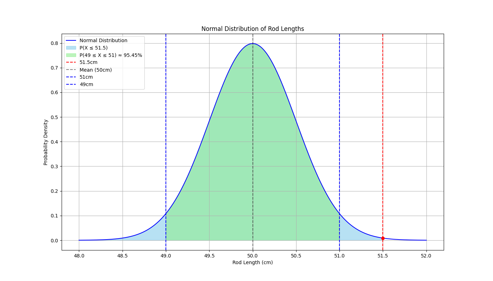

# Statistical Quality Control Analysis

## Problem Description:
A factory produces metal rods with lengths that follow a **normal distribution** with:
- Mean length (μ): 50 cm
- Standard deviation (σ): 0.5 cm

## Goals:
1. **How rare or unusual** it is to observe a rod of **51.5 cm**
2. The **probability** of producing rods **greater than 51.5 cm**
3. The **proportion** of rods that fall within **±1 cm** of the mean
4. How to estimate the **true average rod length** using a **sample** and **knowing** the population standard deviation
5. How to estimate the **true average rod length** using a **sample**, when the population standard deviation is **unknown**

## Method Used:
- Normal distribution analysis
- Z-score calculations
- Cumulative distribution functions (CDF)
- Standard error and confidence intervals
- z-distribution
- t-distribution
- Data visualization (matplotlib)

## Results:
| Question                                        | Answer |
|-------------------------------------------------|--------|
| Rod length = 51.5 cm                            | Z = 3 → Very unusual (0.13%) |
| P(X ≥ 51.5 cm)                                  | 0.13% |
| P(49 ≤ X ≤ 51)                                  | 95.44% |
| 95% CI (n = 25, x̄ = 50.1, σ=0.5) z-distribution | (49.904, 50.296) |
| 95% CI (n = 25, x̄ = 50.1, σ=na)  t-distribution | (49.885, 50.315) |     

## Visualization:

The chart above shows the **sample mean**, **95% CI bounds**, and **margin of error** using the t-distribution.

The chart above shows the **sample mean**, **95% CI bounds**, and **margin of error** using the z-distribution.

## Tools:
- Python
- NumPy, SciPy
- Matplotlib
- Jupyter Notebook

## Content:
- **quality_control_ipynb** is a Jupyter Notebook that shows all the steps to solve the case study.
- **quality_control_function.py** is a Python file where the case study is wrapped up in functions.

## Insights

This analysis can be applied to real-world quality control to detect production issues early and ensure product reliability.